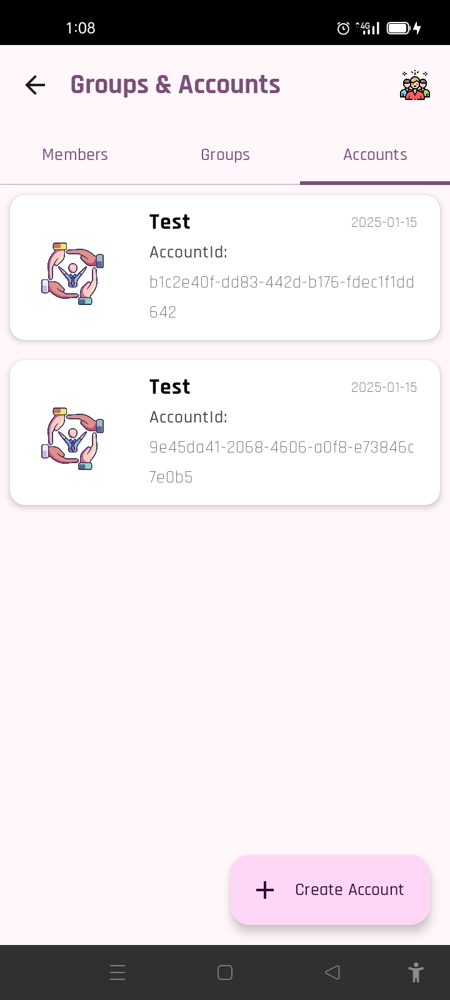

<p align="center"></p>

The Chamaa DeFi Platform combines Compose Multiplatform (Android, Desktop), Ktor server, and Aptos Blockchain to digitize and modernize traditional African savings systems, such as chamaas, stokvels, and esusu, into the world of Decentralized Finance (DeFi).

Inspired by traditional community savings practices in Africa, this platform empowers users by providing a secure, decentralized, and transparent system for managing their collective savings and investments. It leverages Aptos blockchain to ensure immutability and verifiability of transactions, bringing the trust and community support inherent in traditional savings groups into the digital age.

The project is deeply personal to me, inspired by my own experience of how my mother, as a single parent, used a chamaa to pay my school fees. Through the collective efforts of her savings group, she was able to gather enough funds for my education, highlighting the importance of community financial support. My goal is to digitize this practice, giving people better access to a secure and transparent way to manage their group savings.

## Key Features
1. Aptos Blockchain Integration: By incorporating Aptos blockchain, the platform ensures all transactions are secure, transparent, and decentralized, offering users complete control over their funds.
2. Cross-Platform: Built using Kotlin Multiplatform, the platform offers a unified experience across Android and Desktop applications, providing tailored user interfaces for each device while maintaining shared business logic.
3. Ktor Backend: The backend server, built with Ktor, manages user data, handles business logic, and facilitates the secure communication between the app and the blockchain. It also shares DTOs (Data Transfer Objects) between the frontend and backend, ensuring consistent data structures across platforms.
4. Room for Offline Storage: The platform allows users to store and manage their savings group data offline on Android. When an internet connection is available, the data can be synced to the backend server.

## 🛠️ Prerequisites 🛠️
#### IDE
You can either use [IntelliJ IDEA](https://www.jetbrains.com/idea/) or [Android Studio](https://developer.android.com/studio/).


# Setup Instructions

### For KTOR Server

#### PostgreSQL Setup
1. **Install PostgreSQL**: To save data to the database from the **Ktor Server**, you'll need to have **PostgreSQL** installed on your machine. After installation, create a database and obtain your **username** and **password**.

2. **Configure Database Connection**: Once you have your credentials, update the `Data.kt` file with your **username** and **password**. This file is located at:

3. **Create the Database**: Ensure you have a database named `chamaa` created in your PostgreSQL setup.

#### Remote Access with Ngrok
To access the running backend server remotely on **Android** or **Desktop**, you can use [Ngrok](https://ngrok.com/). Follow the instructions in the [Ngrok Setup Guide](https://ngrok.com/docs/getting-started/?os=macos).

- After setting up Ngrok and obtaining your unique URL, replace the `test_url` under `HttpClientProvider` with your Ngrok URL. You can find the relevant file in the following structure:


## Screenshots
### Android
        

[//]: # (### Desktop)

[//]: # (     )

## Architecture
The app is shared between Android, Desktop with Compose Multiplatform and Server with Ktor within the same project.
### Modules
- shared:
  - contains all the shared code between the platforms
- android:
  - contains the android app
- desktop:
  - contains the desktop app
- server:
  - contains the backend ktor app

## Built with
- [Kotlin Multiplatform](https://kotlinlang.org/docs/multiplatform.html) - The Kotlin Multiplatform technology is designed to simplify the development of cross-platform projects.
- [Compose Multiplatform](https://www.jetbrains.com/lp/compose-multiplatform/) -  a modern UI framework for Kotlin that makes building performant and beautiful user interfaces easy and enjoyable.
- [Ktor Server](https://ktor.io/docs/intellij-idea.html) -  Ktor is an asynchronous framework for creating microservices, web applications.
- [Ktor Client](https://ktor.io/docs/getting-started-ktor-client.html) -  a multiplatform asynchronous HTTP client, which allows you to make requests and handle responses.
- [Gemini AI](https://deepmind.google/technologies/gemini) - a multi-modal large language model(LLM) developed by Google DeepMind.
- [SQLDelight](https://github.com/cashapp/sqldelight) - SQLDelight is an open-source library developed by Cash App (formerly Square, Inc.) for working with SQL databases in Kotlin-based Android and multi-platform applications.
- [Multiplatform Settings](https://github.com/russhwolf/multiplatform-settings) - A Kotlin Multiplatform library for saving simple key-value data.
- [Koin](https://insert-koin.io/) - The pragmatic Kotlin & Kotlin Multiplatform Dependency Injection framework.
- [Voyager](https://voyager.adriel.cafe/) - A multiplatform navigation library.
- [Kotlinx-datetime](https://github.com/Kotlin/kotlinx-datetime) - KotlinX multiplatform date/time library.
- [Kotlinx-serilization](https://github.com/Kotlin/kotlinx.serialization) - Kotlin multiplatform / multi-format serialization.

## Run project
### Android
To run the application on android device/emulator:
- open project in Android Studio and run imported android run configuration

### Desktop
Run the desktop application: `./gradlew :desktop:run`

### Server
To run the KTOR Server:
- open project and access the Application.kt file under Server Folder 
- run the main method in the Application.kt file
- N:B ==> In order to run Ktor Server you will require MySQL installed on your machine and have a DB named organiks


## License
```xml
Copyright (c) 2024 Aricha Samson

    Permission is hereby granted, free of charge, to any person obtaining a copy
    of this software and associated documentation files (the "Software"), to deal
    in the Software without restriction, including without limitation the rights
    to use, copy, modify, merge, publish, distribute, sublicense, and/or sell
    copies of the Software, and to permit persons to whom the Software is
    furnished to do so, subject to the following conditions:

    The above copyright notice and this permission notice shall be included in all
    copies or substantial portions of the Software.

    THE SOFTWARE IS PROVIDED "AS IS", WITHOUT WARRANTY OF ANY KIND, EXPRESS OR
    IMPLIED, INCLUDING BUT NOT LIMITED TO THE WARRANTIES OF MERCHANTABILITY,
    FITNESS FOR A PARTICULAR PURPOSE AND NONINFRINGEMENT. IN NO EVENT SHALL THE
    AUTHORS OR COPYRIGHT HOLDERS BE LIABLE FOR ANY CLAIM, DAMAGES OR OTHER
    LIABILITY, WHETHER IN AN ACTION OF CONTRACT, TORT OR OTHERWISE, ARISING FROM,
    OUT OF OR IN CONNECTION WITH THE SOFTWARE OR THE USE OR OTHER DEALINGS IN THE
    SOFTWARE.
```  

  
